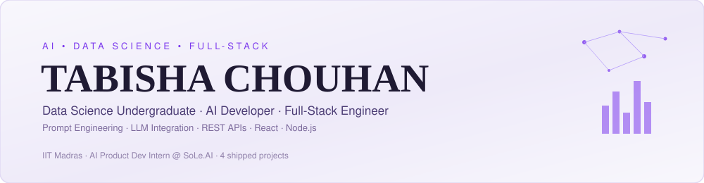

[README (1).md](https://github.com/user-attachments/files/31347389/

 

**AI and Data Science undergrad building full-stack AI products — from LLM-integrated backends to responsive React frontends.**
 
Prompt engineering, structured JSON outputs, and

 

**AI and Data Science undergrad building full-stack AI products — from LLM-integrated backends to responsive React frontends.**
 
Prompt engineering, structured JSON outputs, and shipping end-to-end features from research to deployment.

 

 

## 🎓 Education

| | |
|---|---|
| **Indian Institute of Technology, Madras** | **Masai School** |
| BS in Data Science and Applications | Web Developer — Generative AI & Prompt Engineering |
| 05/2025 – 06/2028 | 10/2025 – 03/2026 |

 

## 💼 Experience

**AI Product Development & Research Intern** · `SoLe.AI` · *05/2026 – Present*
- Built AI workflows using the **Claude Haiku API** to automate proposal generation from client requirements
- Designed prompt engineering strategies to extract structured data (objectives, competencies, themes) from unstructured client briefs
- Built and integrated RESTful APIs (React.js, Express.js) with structured JSON validation for reliable AI outputs
- Resolved integration bugs through structured debugging and testing, improving system reliability

 

## 🚀 Projects

<table>
<tr>
<td width="50%" valign="top">

**🩺 TriageMate**
*AI-Powered Symptom & Urgency Assessor — Compass Crew AI Innovation Challenge 2026*

Interprets plain-language symptom descriptions and returns a structured urgency assessment (self-care / see a doctor / emergency), explicitly scoped as an awareness aid, not a diagnostic tool.

`Node.js` `Express` `Prompt Engineering` `Supabase (Postgres)`

</td>
<td width="50%" valign="top">

**🎨 Art Collab**
*Collaborative Platform for Artists*

Full-stack platform connecting artists via project-based collaboration, with JWT auth, role-based authorization, and a scalable PostgreSQL schema.

`React` `Node.js` `Express` `Supabase` `Vercel` `Render`

</td>
</tr>
<tr>
<td width="50%" valign="top">

**🗺️ Wanderlust Canvas**
*Travel Planning Web Application*

Responsive itinerary-management and destination-exploration app with reusable React components, optimized across desktop and mobile.

`React.js` `JavaScript` `CSS`

</td>
<td width="50%" valign="top">

**✨ Your next project**
*Space reserved*

Pin your 4th-best repo here — recruiters read left-to-right, top-to-bottom, so lead with your strongest work.

`Add tech stack here`

</td>
</tr>
</table>

 

## 🛠️ Technical Toolkit

**AI & Data**

**Web Development**

**Databases**

**Languages & Tools**

 

## 🏆 Certifications & Beyond

| | |
|---|---|
| **McKinsey Forward Program** | Strategic Thinking · Problem Solving · Leadership · Communication |
| **GenAI Powered Data Analytics** — Tata (Forage) | EDA · Predictive Analytics · AI Strategy · Model Selection & Validation |

 

## 📊 GitHub Stats

 

Let's connect and build meaningful things together.

 shipping end-to-end features from research to deployment.

 

 

## 🎓 Education

| | |
|---|---|
| **Indian Institute of Technology, Madras** | **Masai School** |
| BS in Data Science and Applications | Web Developer — Generative AI & Prompt Engineering |
| 05/2025 – 06/2028 | 10/2025 – 03/2026 |

 

## 💼 Experience

**AI Product Development & Research Intern** · `SoLe.AI` · *05/2026 – Present*
- Built AI workflows using the **Claude Haiku API** to automate proposal generation from client requirements
- Designed prompt engineering strategies to extract structured data (objectives, competencies, themes) from unstructured client briefs
- Built and integrated RESTful APIs (React.js, Express.js) with structured JSON validation for reliable AI outputs
- Resolved integration bugs through structured debugging and testing, improving system reliability

 

## 🚀 Projects

<table>
<tr>
<td width="50%" valign="top">

**🩺 TriageMate**
*AI-Powered Symptom & Urgency Assessor — Compass Crew AI Innovation Challenge 2026*

Interprets plain-language symptom descriptions and returns a structured urgency assessment (self-care / see a doctor / emergency), explicitly scoped as an awareness aid, not a diagnostic tool.

`Node.js` `Express` `Prompt Engineering` `Supabase (Postgres)`

</td>
<td width="50%" valign="top">

**🎨 Art Collab**
*Collaborative Platform for Artists*

Full-stack platform connecting artists via project-based collaboration, with JWT auth, role-based authorization, and a scalable PostgreSQL schema.

`React` `Node.js` `Express` `Supabase` `Vercel` `Render`

</td>
</tr>
<tr>
<td width="50%" valign="top">

**🗺️ Wanderlust Canvas**
*Travel Planning Web Application*

Responsive itinerary-management and destination-exploration app with reusable React components, optimized across desktop and mobile.

`React.js` `JavaScript` `CSS`

</td>
<td width="50%" valign="top">

**✨ Your next project**
*Space reserved*

Pin your 4th-best repo here — recruiters read left-to-right, top-to-bottom, so lead with your strongest work.

`Add tech stack here`

</td>
</tr>
</table>

 

## 🛠️ Technical Toolkit

**AI & Data**

**Web Development**

**Databases**

**Languages & Tools**

 

## 🏆 Certifications & Beyond

| | |
|---|---|
| **McKinsey Forward Program** | Strategic Thinking · Problem Solving · Leadership · Communication |
| **GenAI Powered Data Analytics** — Tata (Forage) | EDA · Predictive Analytics · AI Strategy · Model Selection & Validation |

 

## 📊 GitHub Stats

 

Let's connect and build meaningful things together.

